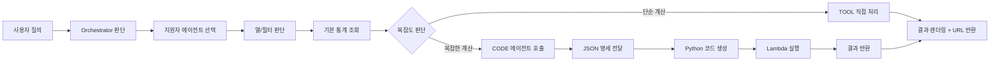
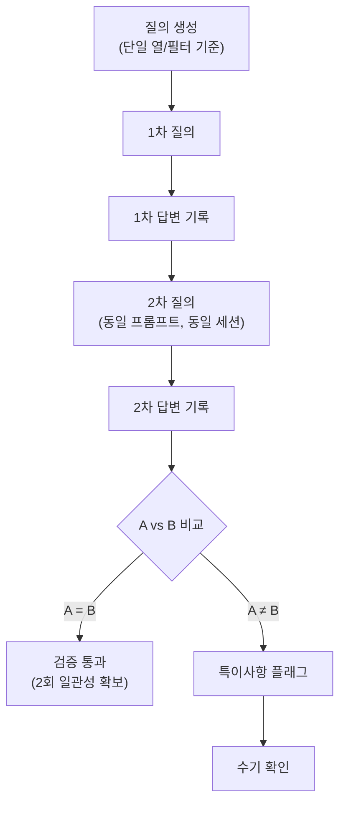
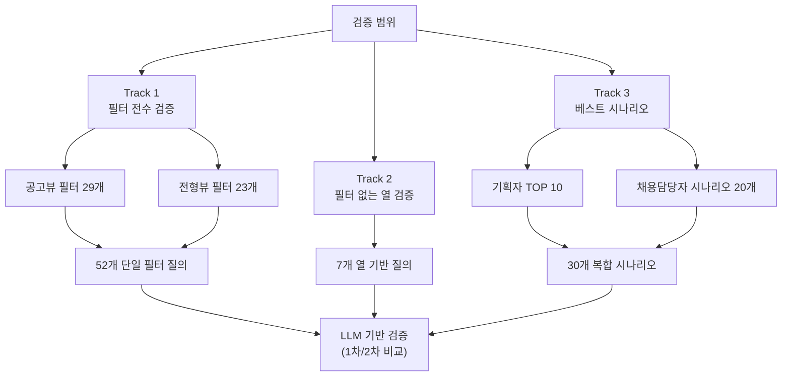

## 1. 개요

지원자 관리 에이전트는 사용자의 통계/분석 질의를 처리하는 에이전트로, 질의 복잡도에 따라 TOOL 직접 처리 또는 CODE 에이전트 호출로 분기한다.

---

## 2. 에이전트 플로우

### 2.1 전체 흐름

### 2.2 상세 플로우

| 단계 | 설명                                                                                      |
| ---- | ----------------------------------------------------------------------------------------- |
| 1    | 사용자가 지원자 관련 통계 질의 입력                                                       |
| 2    | Orchestrator가 질의 유형 판단 후 지원자 에이전트 선택                                     |
| 3    | 에이전트가 필요한 열(Column)과 필터(Filter) 결정                                          |
| 4    | 필터 기준으로 기본 통계 조회 (예: 나이가 NN세인 지원자 수)                                |
| 5    | 복잡도 판단 기준에 따라 분기                                                              |
| 5.1  | [복잡한 계산] CODE 에이전트에 JSON 명세 전달 → Python 코드 생성 → Lambda 실행 → 결과 반환 |
| 5.2  | [단순 계산] TOOL에서 직접 통계 처리                                                       |
| 6    | 통계 데이터를 화면에 렌더링하고 URL 반환                                                  |

---

## 3. 복잡도 판단 기준

### 3.1 에이전트 분기 기준표

| 사용 에이전트     | 계산 로직                | 사용자 요청 예시                                            | 적용 필터                                        |
| ----------------- | ------------------------ | ----------------------------------------------------------- | ------------------------------------------------ |
| **TOOL**          | ~별 지원자 수 (5개 이하) | 지원경로별 지원자 수, 지원분야별 지원자 수, 전형단계별 인원 | 지원경로, 지원분야, 전형결과, 최종학력, 졸업구분 |
| **TOOL**          | ~별 비율 (5개 이하)      | 종합평가 상위 N%, 역량검사 점수 상위 N%                     | 종합평가 평균, 역량 종합점수, 역량 종합등수      |
| **CODE**          | ~별 지원자 수 (5개 초과) | 지원경로별 지원자 수, 지원분야별 지원자 수, 전형단계별 인원 | 지원경로, 지원분야, 전형결과, 최종학력, 졸업구분 |
| **CODE**          | ~별 지원자 수 + 정렬     | TOP N, 많은 순/적은 순 정렬                                 | 지원경로, 지원분야, 전형결과, 최종학력, 졸업구분 |
| **CODE**          | ~별 평균(AVG)            | 공고별 종합평가 평균, 지원경로별 종합평가 평균              | 종합평가 평균, 역량 종합점수, 역량 종합등수      |
| **CODE + 벡터DB** | 의미 기반 집합 통계      | 서울권 학교 수, 지거국 학교 수, 어학 계열 전공 수           | 학교명, 자격증명, 회사명 등                      |

### 3.2 강제 CODE 전환 조건

- 지원자 수 ≥ **30,000명**

---

## 4. 검증 방식

### 4.1 검증 목적

1. 에이전트가 올바른 열/필터를 호출하는지 확인
2. 동일 질의에 대해 일관된 통계 결과를 반환하는지 확인

### 4.2 검증 절차

### 4.3 검증 판단 기준

| 검증 항목              | 판단 방식               | 결과             |
| ---------------------- | ----------------------- | ---------------- |
| 필수 열/필터 호출 여부 | 규칙 기반 (기대값 매칭) | Pass / Fail      |
| 통계 데이터 일관성     | LLM 비교 (1차 vs 2차)   | 일치 / 차이 발생 |
| 차이 발생 시           | 수기 확인 플래그        | 특이사항 체크    |

### 4.4 동일 세션(ConversationId 공유) 방식 채택 이유

LLM은 동일 세션에서 같은 질문을 반복하면 이전 답변을 참조해 보정하는 경향이 있음. 이를 활용하여:

- **A = B인 경우**: 1차에서 이미 최적 답변 도달 → 신뢰도 높음
- **A ≠ B인 경우**: 1차 답변에 개선 여지가 있었다는 신호 → 프롬프트/로직 점검 필요

### 4.5 차이 유형 분류

| 차이 유형     | 의미                 | 액션               |
| ------------- | -------------------- | ------------------ |
| 열/필터 변경  | 에이전트 판단 불안정 | 프롬프트 개선 검토 |
| 통계값만 변경 | 계산 로직 이슈 가능  | 코드/API 점검      |
| 표현만 변경   | 실질 차이 없음       | Pass 처리          |

---

## 5. 검증 범위

### 5.1 검증 구조 개요

### 5.2 Track 1: 필터 전수 검증 (수기)

단일 필터를 호출하는 질의로 구성하여 검증 진행

### 공고뷰 필터 (29개)

| 카테고리           | 필터명                                                                                                                | 개수 |
| ------------------ | --------------------------------------------------------------------------------------------------------------------- | ---- |
| 기본 정보          | 지원서 제출 여부, 지원서 등록 구분, 과거 지원 이력, 특이지원자, 열람 여부, 관리자 업로드 파일                         | 6    |
| 지원자 기초 정보   | 지원 경로, 국적, 병역, 장애, 보훈                                                                                     | 5    |
| 학력/경력 정보     | 최종학력, 졸업 구분, 고등학교명, 대학교명, 대학원명, 대학교 전공명, 대학원 전공명, 학점, 경력기준, 경력기간, 프로젝트 | 11   |
| 어학/자격/기타정보 | 외국어 시험, 외국어 활용, 해외경험, 자격증, 교육이수, 학내외 활동, 봉사활동                                           | 7    |

### 전형뷰 필터 (23개)

| 카테고리          | 필터명                                                                                                      | 개수 |
| ----------------- | ----------------------------------------------------------------------------------------------------------- | ---- |
| 평가 정보         | 최종 합격 여부, 전형 결과, 스크리닝 종합 결과, 지원서 커트라인, 역량검사 커트라인, 최종 평가자, 일반 평가자 | 7    |
| 역량검사 정보     | 응시 현황, 역량 종합 등급, 역량 종합 등수, 역량 종합 등수(분야내), 응답 신뢰성                              | 5    |
| NCS 역량검사 정보 | 핵심 종합 등급, 핵심 종합 점수, 핵심 종합 등수, 핵심 종합 등수(분야 내), 응답 신뢰성(NCS)                   | 5    |
| 메시지 정보       | 다음 전형 참석, 면접 참석 회신, 전형 안내, 합격자 발표, SMS 발송 시도, 메일 발송 시도                       | 6    |

**※ 제외 항목**: 종합 평가 평균, 역량 등급 점수

**Track 1 총 질의 수: 52개**

### 5.3 Track 2: 필터 없는 열 검증

필터로 제공되지 않지만 질의에 사용될 수 있는 열

| 열              | 필드명                    | 질의 예시                    |
| --------------- | ------------------------- | ---------------------------- |
| 성별            | genderFlag                | "남성 지원자 수"             |
| 나이            | age                       | "26세~35세 지원자"           |
| 지원서 작성일자 | createDatetime            | "이번 달에 작성된 지원서"    |
| 이름            | name                      | "김OO 지원자 검색"           |
| 총경력          | totalCareer               | "경력 5년 이상 지원자"       |
| 종합등수        | totalRankOverall          | "상위 10명 지원자"           |
| 지망            | priority (applySector 내) | "1지망으로 지원한 지원자 수" |

**Track 2 총 질의 수: 7개**

### 5.4 Track 3: 베스트 시나리오 검증 (LLM 기반)

### 기본 조건

- 기간 필터 기본값: **1년**
- 공고명/채용분야명: **$공고명$**, **$채용분야명$** 으로 표기 (추후 치환)

### 검증 대상 기업 특성

- 업종: 다양 (그룹 형태 기업)
- 채용 규모: 연간 지원자 30,000명 이상
- 전형 구조: 서류 → 역량검사 → 면접 (다양한 변형 존재)
- 채용 유형: 공개채용 비중 높음, 경력직 비중 높음
- 사용자: 실무 채용담당자 (현업 부서장 리포팅)

### 기획자 TOP 10 시나리오

| **ID** | **질의**                                             | **핵심 필터/열** | **패턴**         |
| ------ | ---------------------------------------------------- | ---------------- | ---------------- |
| T-01   | 지원서 제출 완료한 지원자 수 조회해줘                | 지원서 제출      | 단일 조건 카운트 |
| T-02   | 지원경로별로 지원자 수 조회해줘                      | 지원경로         | 그룹핑           |
| T-03   | 서울대학교 지원자 수 조회해줘                        | 학교명           | 특정값 검색      |
| T-04   | 대학교별 지원자 수 조회해줘                          | 학교명           | 그룹핑 (다수)    |
| T-05   | 서울권 대학교의 지원자 수 통계내줘                   | 학교명           | 의미 기반 집합   |
| T-06   | 지원자 수가 많은 순으로 지원경로를 정렬해줘          | 지원경로         | 정렬             |
| T-07   | 공고별로 전체 지원자의 종합점수 평균을 내줘          | 종합점수         | AVG 연산         |
| T-08   | 지원을 특히 많이한 학교들이 어디에있는지 알 수 있어? | 학교명           | 자연어 TOP N     |
| T-09   | $공고명$에서 지원분야별로 지원자 수 조회해줘         | 공고 + 지원분야  | 복합 조건 그룹핑 |
| T-10   | $공고명$에서 지원분야별로 지원자 많은순으로 조회해줘 | 공고 + 지원분야  | 복합 조건 + 정렬 |

### 채용담당자 추가 시나리오 (20개)

_[별도 섹션에서 상세 정의]_

**Track 3 총 질의 수: 30개**

---

## 6. 검증 결과 기록 항목

모든 Track은 동일한 검증 프로세스(1차/2차 답변 LLM 비교)를 따르며, 동일한 컬럼으로 기록한다.

| 항목              | 설명                                   |
| ----------------- | -------------------------------------- |
| 질의 ID           | 고유 식별자                            |
| Track             | Track 1 / Track 2 / Track 3            |
| 카테고리          | 공고뷰-기본 정보, 시나리오-지원현황 등 |
| 질의 내용         | 사용자 질의 텍스트                     |
| 기대 열/필터      | 호출되어야 하는 열 또는 필터           |
| 1차 답변          | 첫 번째 응답 내용                      |
| 2차 답변          | 두 번째 응답 내용 (동일 세션)          |
| 열/필터 일치 여부 | Pass / Fail                            |
| 답변 일관성       | 일치 / 차이 발생                       |
| 차이 유형         | 열/필터 변경 / 통계값 변경 / 표현 변경 |
| 특이사항          | 메모                                   |
| 더블체크 여부     | 수기 확인 완료 / 미완료                |

※ Track 1, 2는 단순 질의로 LLM 검증 후 수기 더블체크 권장

---

## 7. 검증 질의

- csv

---

## 8. 스코어링 규칙

### 8.1. 평가 지표 (스코어링 기반)

| 지표               | 설명                                            | 점수 기준 |
| ------------------ | ----------------------------------------------- | --------- |
| **열/필터 정확성** | Response에서 기대한 열/필터가 사용되었는지 판단 | 0~100점   |
| **답변 일관성**    | 1차/2차 답변이 의미적으로 동일한지 판단         | 0~100점   |
| **유의사항**       | 추가 필터 사용, 차이 유형 등 특이점 기록        | 텍스트    |

### 8.1.1. 열/필터 정확성 판단 방법

**Response에서 추론 가능한 정보**

| 추론 가능 항목 | 위치                     | 예시                        |
| -------------- | ------------------------ | --------------------------- |
| 사용된 필터/열 | assistantMessage 내 언급 | "최근 1년 기준" → 기간 필터 |
| 집계 기준      | columnName               | "채용분야", "TOEIC 평균"    |
| 데이터 구조    | rowValue                 | 실제 출력된 데이터          |

**점수 기준 (안)**

| **점수** | **기준**                                           |
| -------- | -------------------------------------------------- |
| 100      | 기대 필터/열이 모두 사용됨                         |
| 80       | 기대 필터/열 사용 + 추가 필터 존재 (유의사항 기록) |
| 60       | 기대 필터/열 일부만 사용됨                         |
| 40       | 기대 필터/열과 유사하지만 다른 필터 사용           |
| 0        | 기대 필터/열과 무관한 결과                         |

### 8.1.2. 답변 일관성 판단 방법

Sample 1, 2 비교 시 확인 포인트:

| **비교 항목** | **Sample 1** | **Sample 2**  | **일치 여부** |
| ------------- | ------------ | ------------- | ------------- |
| 1위 채용분야  | 경력-2-영업  | 경력-2-영업자 | △ (오타 차이) |
| 1위 평균 점수 | 990점        | 990.0점       | ✓             |
| Top 5 순위    | 동일         | 동일          | ✓             |
| 테이블 컬럼   | 5개          | 3개           | △ (표현 차이) |

**점수 기준 (안)**

| 점수 | 기준                                                |
| ---- | --------------------------------------------------- |
| 100  | 핵심 데이터(순위, 수치) 완전 일치                   |
| 80   | 핵심 데이터 일치 + 표현/포맷 차이                   |
| 60   | 핵심 데이터 대부분 일치, 일부 순서나 수치 미세 차이 |
| 40   | 핵심 데이터 일부만 일치                             |
| 0    | 완전히 다른 결과                                    |

### 8.2. 입력 데이터

`질의 ID: T-22
질의 내용: 채용분야별로 토익 평균이랑 학점 평균을 표로 보여주고 토익 평균 높은 순 Top 5로 정렬해줘
기대 필터/열: 지원분야 + 외국어시험 + 학점
1차 응답: {sample_1}
2차 응답: {sample_2}`

### 8.3. 평가 출력 형식

`{
  "query_id": "T-22",
  "filter_accuracy": {
    "score": 80,
    "expected": ["지원분야", "외국어시험", "학점"],
    "detected": ["지원분야", "외국어시험", "기간"],
    "note": "학점 필터 미사용, 기간 필터(최근 1년) 자동 추가됨"
  },
  "consistency": {
    "score": 80,
    "matched": [
      "1위 채용분야(경력-2-ㄹㅇㄴㅋㄴㅇㄹ)",
      "평균 점수(990점)",
      "Top 5 순위"
    ],
    "diff": ["테이블 컬럼 수 차이(5개 vs 3개)", "채용분야명 오타 차이"],
    "note": "핵심 데이터 일치, 출력 포맷과 상세 컬럼만 상이"
  },
  "total_score": 80,
  "remarks": "1차 답변이 더 상세한 테이블(최소/최대 컬럼 포함) 제공. 핵심 결과는 동일하나 학점 필터가 적용되지 않음."
}`

_E.o.D_
