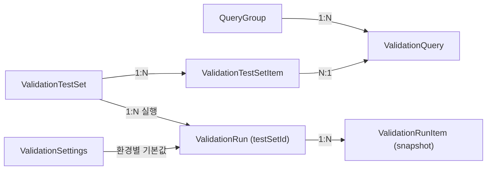
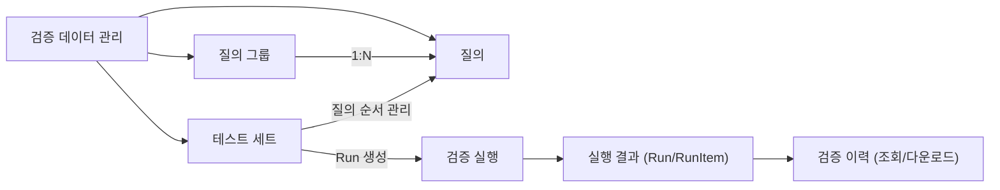
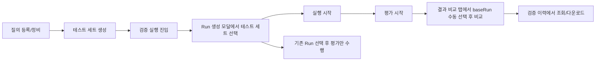

# AQB Backoffice Frontend 정보구조도 (PM 관점)

- 문서 목적: AQB Backoffice의 화면 구조, 도메인 객체, 핵심 운영 흐름을 PM/운영 관점에서 빠르게 파악
- 대상 독자: PM, PO, 운영 리드, QA 리드
- 기준 코드: `backoffice/frontend/src`
- 최신 갱신일: 2026-02-27

## 1. 제품 구조 한눈에 보기

AQB Backoffice는 다음 6개 도메인으로 구성됩니다.

1. 에이전트 검증 운영
2. 검증 데이터 관리
3. 프롬프트 운영
4. 환경설정 관리
5. 레거시 Generic 검증 운영
6. 공통 운영 컨트롤(환경/인증/진행 알림)

상단 GNB 공통 컨트롤:

1. 환경 전환 (`dev`, `st2`, `st`, `pr`)
2. 진행 중 Run 알림 Popover (실행/평가 중 run + unread 배지)
3. 공식 로그인 세션 상태/수동 갱신 (`/login` + 자동 갱신 루프)
4. 레거시 cURL 파싱 fallback (기본 비활성, `VITE_ENABLE_LEGACY_CURL_LOGIN=true`일 때만 노출)

## 2. 내비게이션 IA

### 2.1 메뉴 구조

- `에이전트 검증 운영`
- `검증 실행` (`/validation/run`)
- `검증 이력` (`/validation/history`)
- `대시보드` (`/validation/dashboard`)
- `검증 데이터 관리`
- `질의 관리` (`/validation-data/queries`)
- `질의 그룹` (`/validation-data/query-groups`)
- `테스트 세트` (`/validation-data/test-sets`)
- `환경설정` (`/validation-settings`)
- `프롬프트 관리` (`/prompt`)
- `레거시 검증` (`/generic-legacy`)
- `Login` (`/login`, 인증 필요 경로 진입 전)

레거시 URL 호환:

1. `/queries` -> `/validation-data/queries`
2. `/query-groups` -> `/validation-data/query-groups`

### 2.2 메뉴-페이지-목적 매핑

| 메뉴 | URL | 화면 컴포넌트 | 제품 목적 |
|---|---|---|---|
| 검증 실행 | `/validation/run` | `AgentValidationManagementPage` (run 섹션) | 테스트 세트 선택/Run 생성/Run 실행/평가/비교 워크벤치 |
| 검증 이력 | `/validation/history` | `AgentValidationManagementPage` (history 섹션) | Run 목록 조회 |
| 검증 이력 상세 | `/validation/history/:runId?tab=history|results` | `AgentValidationManagementPage` (history-detail 섹션) | Run 상세를 `검증 이력`/`평가 결과` 탭으로 조회하고 실행 워크벤치 연결 |
| 대시보드 | `/validation/dashboard` | `AgentValidationManagementPage` (dashboard 섹션) | 테스트 세트 기준 성과/실패 패턴 조회 |
| 질의 관리 | `/validation-data/queries` | `QueryManagementPage` | 단일 질의 CRUD, 검색/필터, 벌크 업로드/업데이트, 테스트 세트 사용 추적 |
| 질의 그룹 | `/validation-data/query-groups` | `QueryGroupManagementPage` | 질의 그룹 CRUD(질의 묶기) |
| 테스트 세트 | `/validation-data/test-sets` | `TestSetManagementPage` | 테스트 세트 CRUD, 질의 구성, 기본 파라미터 관리 |
| 환경설정 | `/validation-settings` | `ValidationSettingsPage` | 환경별 실행 기본값/페이지네이션 기본 제한값 관리 |
| 프롬프트 관리 | `/prompt` | `PromptManagementPage` | 워커 프롬프트 현재값(ATS) 조회 + 직전값(내부 DB) 조회/수정/초기화 |
| 레거시 검증 | `/generic-legacy` | `GenericRunPage` | 레거시 검증 플로우 운영 |

### 2.3 공통 페이지 헤더 포맷

모든 메뉴 페이지는 `AppLayout`에서 동일한 상단 포맷을 사용한다.

1. 페이지 최상단에 브레드크럼만 1회 노출한다.
2. 각 페이지 내부(`Card title`, `Typography.Title`)의 페이지 타이틀은 사용하지 않는다.
3. 상세 화면의 로컬 브레드크럼은 제거하고 전역 브레드크럼으로 경로 문맥을 통일한다.

## 3. 핵심 도메인 객체

### 3.1 주요 객체

- `QueryGroup`: 질의 분류
- `ValidationQuery`: 검증 대상 질의 단위
- `ValidationTestSet`: 실행 설계 단위(질의 묶음 + 기본 파라미터)
- `ValidationTestSetItem`: 테스트 세트 내 질의 순서
- `ValidationRun`: 테스트 세트를 실제 실행한 결과 단위
- `ValidationRunItem`: 런 내부 개별 실행 레코드(질의 x 반복/방)
- `ValidationSettings`: 환경별 실행 기본값

### 3.2 객체 관계

핵심 해석:

1. 테스트 세트는 실행 이전의 설계 자산이고 환경 비귀속이다.
2. Run은 생성 시점 스냅샷을 갖고, 이후 테스트 세트 수정과 독립적으로 유지된다.
3. Run은 `testSetId`를 통해 어떤 테스트 세트에서 생성됐는지 추적한다.

## 4. 운영 흐름 (핵심 시나리오)

### 4.1 질의 -> 테스트 세트 설계 흐름

1. `질의 관리`에서 질의를 등록/정비
2. `대규모 업데이트`로 현재 필터 결과를 CSV 내려받아 질의 필드를 일괄 수정
3. `테스트 세트` 컬럼에서 질의별 사용 개수/사용 중인 테스트 세트를 확인
4. 질의를 선택하거나 `전체 선택(필터 결과)`로 선택 집합 구성
5. `테스트 세트 만들기` 또는 `테스트 세트에 추가`를 질의 관리 화면에서 바로 수행
6. 생성 시 이름/설명을 입력하고, 추가 시 대상 테스트 세트를 선택해 저장

### 4.2 검증 실행 워크벤치 흐름

1. `검증 실행` 진입 시 기본 탭은 `워크벤치`
2. 상단에서 현재 Run을 선택해 실행/평가 대상을 확인
3. `Run 생성` 버튼 클릭 → 모달에서 테스트 세트 선택, 기본값 미리보기, 오버라이드 입력, Run 이름 입력 후 생성
4. `워크벤치` 탭에서 실행/평가 수행 및 Run item 테이블 조회
5. `결과 비교` 탭에서 base run 선택 후 비교 실행

운영 원칙:

1. 실행은 `PENDING` Run에서만 시작 가능
2. 평가는 실행 결과가 있는 Run에서만 시작 가능
3. 비교는 현재 Run + 수동 baseRun 선택이 모두 필요
4. 비교 후보는 동일 테스트 세트의 Run 목록에서 선택

### 4.3 검증 이력 조회 흐름

1. `검증 이력`에서 목록/상세 조회
2. 상세에서 `검증 실행에서 이 run 열기` 클릭
3. `/validation/run?runId=...&testSetId=...`로 이동
4. 실행 워크벤치에서 해당 Run 재분석/평가/비교

`검증 이력`은 조회/다운로드 중심(read-only)이며 실행 액션은 제공하지 않는다.

검증 이력 상세의 정보 위계:

1. 페이지 헤더(전역): 브레드크럼(1회)
2. 상세 헤더(로컬): Run 이름/상태/액션
3. 컨텍스트: `테스트 세트/에이전트/평가 모델/마지막 업데이트` 라벨-값 메타
4. 탭 콘텐츠: `검증 이력`/`평가 결과`는 섹션 타이틀 + 툴바 + 테이블 구조로 렌더링

평가 결과 탭:

1. 분포 섹션은 제거한다.
2. 저점/오류/느림 탐색은 결과 테이블의 정렬/필터에서 수행한다.

## 5. 화면 간 상태 전달 전략

페이지 간 전달은 query param 기준을 기본으로 사용한다.

1. `testSetId`
2. `runId`
3. `tab` (`history` | `results`, 검증 이력 상세 전용)

예시:

1. `테스트 세트` -> `검증 실행`: `/validation/run?testSetId=ts1`
2. `검증 이력 상세` -> `검증 실행`: `/validation/run?runId=r1&testSetId=ts1`
3. `검증 이력 상세` 내부 탭 상태: `/validation/history/r1?tab=history`, `/validation/history/r1?tab=results`

## 6. 도메인 용어 정리 (Mermaid)

## 7. 테스트 방법(사용 시나리오) (Mermaid)

## 8. 운영 체크리스트

### 8.1 메뉴/라우팅

1. `/queries`, `/query-groups` 레거시 URL이 신규 경로로 리다이렉트되는지
2. `질의 관리`에서 대규모 업데이트(CSV 다운로드/업로드/미리보기/업데이트)가 정상 동작하는지
3. `질의 관리`에서 선택 집합(수동/필터 전체)으로 테스트 세트 생성/추가가 정상 동작하는지
4. 이력 상세 -> 실행 링크(`runId`, `testSetId`)가 정상 반영되는지

### 8.2 실행 워크벤치

1. 테스트 세트 미선택 시 Run 생성 비활성
2. `PENDING` 외 Run에서 실행 버튼 비활성
3. 실행 결과 없는 Run에서 평가 버튼 비활성
4. baseRun 미선택 시 비교 버튼 비활성

### 8.3 데이터 정합성

1. 테스트 세트 수정 후 과거 Run 결과가 변하지 않는지(snapshot 고정)
2. Run payload에 `testSetId`가 일관되게 노출되는지
3. 동일 테스트 세트 기준으로 run 목록/비교 후보가 일관되게 필터되는지
