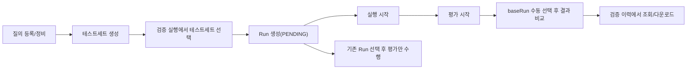

# AQB Backoffice Frontend 정보구조도 (PM 관점)

- 문서 목적: AQB Backoffice의 화면 구조, 도메인 객체, 핵심 운영 흐름을 PM/운영 관점에서 빠르게 파악
- 대상 독자: PM, PO, 운영 리드, QA 리드
- 기준 코드: `backoffice/frontend/src`
- 최신 갱신일: 2026-02-17

## 1. 제품 구조 한눈에 보기

AQB Backoffice는 다음 6개 도메인으로 구성됩니다.

1. 에이전트 검증 운영
2. 검증 데이터 관리
3. 프롬프트 운영
4. 검증 기본 설정 관리
5. 레거시 Generic 검증 운영
6. 공통 운영 컨트롤(환경/토큰)

상단 GNB 공통 컨트롤:

1. 환경 전환 (`dev`, `st2`, `st`, `pr`)
2. 인증 토큰 입력/상태 점검(cURL 파싱 기반)

## 2. 내비게이션 IA

### 2.1 메뉴 구조

- `에이전트 검증 운영`
- `검증 실행` (`/validation/run`)
- `검증 이력` (`/validation/history`)
- `대시보드` (`/validation/dashboard`)
- `검증 데이터 관리`
- `질의 관리` (`/validation-data/queries`)
- `질의 그룹` (`/validation-data/query-groups`)
- `테스트 세트` (`/validation-data/test-sets`)
- `Validation Settings` (`/validation-settings`)
- `Prompt` (`/prompt`)
- `Generic Legacy` (`/generic-legacy`)

레거시 URL 호환:

1. `/queries` -> `/validation-data/queries`
2. `/query-groups` -> `/validation-data/query-groups`

### 2.2 메뉴-페이지-목적 매핑

| 메뉴 | URL | 화면 컴포넌트 | 제품 목적 |
|---|---|---|---|
| 검증 실행 | `/validation/run` | `AgentValidationManagementPage` (run 섹션) | 테스트세트 선택/Run 생성/Run 실행/평가/비교 워크벤치 |
| 검증 이력 | `/validation/history` | `AgentValidationManagementPage` (history 섹션) | Run 목록 조회 |
| 검증 이력 상세 | `/validation/history/:runId` | `AgentValidationManagementPage` (history-detail 섹션) | Run 상세 조회 및 실행 워크벤치 연결 |
| 대시보드 | `/validation/dashboard` | `AgentValidationManagementPage` (dashboard 섹션) | 그룹 단위 성과/실패 패턴 조회 |
| 질의 관리 | `/validation-data/queries` | `QueryManagementPage` | 단일 질의 CRUD, 검색/필터, 벌크 업로드 |
| 질의 그룹 | `/validation-data/query-groups` | `QueryGroupManagementPage` | 질의 그룹 CRUD, 기본 대상 어시스턴트/기준 관리 |
| 테스트 세트 | `/validation-data/test-sets` | `TestSetManagementPage` | 테스트세트 CRUD, 질의 구성, 기본 파라미터 관리 |
| Validation Settings | `/validation-settings` | `ValidationSettingsPage` | 환경별 실행 기본값 관리 |
| Prompt | `/prompt` | `PromptManagementPage` | 워커 프롬프트 조회/수정/초기화 |
| Generic Legacy | `/generic-legacy` | `GenericRunPage` | 레거시 검증 플로우 운영 |

## 3. 핵심 도메인 객체

### 3.1 주요 객체

- `QueryGroup`: 질의 분류 + 기본 대상 어시스턴트/기본 평가 기준
- `ValidationQuery`: 검증 대상 질의 단위
- `ValidationTestSet`: 실행 설계 단위(질의 묶음 + 기본 파라미터)
- `ValidationTestSetItem`: 테스트세트 내 질의 순서
- `ValidationRun`: 테스트세트를 실제 실행한 결과 단위
- `ValidationRunItem`: 런 내부 개별 실행 레코드(질의 x 반복/방)
- `ValidationSettings`: 환경별 실행 기본값

### 3.2 객체 관계

핵심 해석:

1. 테스트세트는 실행 이전의 설계 자산이고 환경 비귀속이다.
2. Run은 생성 시점 스냅샷을 갖고, 이후 테스트세트 수정과 독립적으로 유지된다.
3. Run은 `testSetId`를 통해 어떤 테스트세트에서 생성됐는지 추적한다.

## 4. 운영 흐름 (핵심 시나리오)

### 4.1 질의 -> 테스트세트 설계 흐름

1. `질의 관리`에서 질의를 등록/정비
2. 질의를 선택하고 `테스트 세트 만들기` 클릭
3. `/validation-data/test-sets?mode=create&queryIds=...`로 이동
4. 테스트세트 생성 모달에서 질의/기본 파라미터 저장

### 4.2 검증 실행 워크벤치 흐름

1. `검증 실행`에서 테스트세트 선택
2. `Run 생성(PENDING)` (필요 시 일부 파라미터 오버라이드)
3. 생성된 Run 또는 기존 Run 선택
4. 실행/평가/비교를 run 단위로 독립 수행

운영 원칙:

1. 실행은 `PENDING` Run에서만 시작 가능
2. 평가는 실행 결과가 있는 Run에서만 시작 가능
3. 비교는 현재 Run + 수동 baseRun 선택이 모두 필요
4. 비교 후보는 동일 테스트세트의 Run 목록에서 선택

### 4.3 검증 이력 조회 흐름

1. `검증 이력`에서 목록/상세 조회
2. 상세에서 `검증 실행에서 이 run 열기` 클릭
3. `/validation/run?runId=...&testSetId=...`로 이동
4. 실행 워크벤치에서 해당 Run 재분석/평가/비교

`검증 이력`은 조회/다운로드 중심(read-only)이며 실행 액션은 제공하지 않는다.

## 5. 화면 간 상태 전달 전략

페이지 간 전달은 query param 기준으로 통일:

1. `mode=create`
2. `queryIds`
3. `testSetId`
4. `runId`

예시:

1. `질의 관리` -> `테스트 세트`: `/validation-data/test-sets?mode=create&queryIds=q1,q2`
2. `테스트 세트` -> `검증 실행`: `/validation/run?testSetId=ts1`
3. `검증 이력 상세` -> `검증 실행`: `/validation/run?runId=r1&testSetId=ts1`

## 6. 도메인 용어 정리 (Mermaid)

## 7. 테스트 방법(사용 시나리오) (Mermaid)

## 8. 운영 체크리스트

### 8.1 메뉴/라우팅

1. `/queries`, `/query-groups` 레거시 URL이 신규 경로로 리다이렉트되는지
2. 테스트세트 생성 파라미터(`mode=create`, `queryIds`)가 정상 반영되는지
3. 이력 상세 -> 실행 링크(`runId`, `testSetId`)가 정상 반영되는지

### 8.2 실행 워크벤치

1. 테스트세트 미선택 시 Run 생성 비활성
2. `PENDING` 외 Run에서 실행 버튼 비활성
3. 실행 결과 없는 Run에서 평가 버튼 비활성
4. baseRun 미선택 시 비교 버튼 비활성

### 8.3 데이터 정합성

1. 테스트세트 수정 후 과거 Run 결과가 변하지 않는지(snapshot 고정)
2. Run payload에 `testSetId`가 일관되게 노출되는지
3. 동일 테스트세트 기준으로 run 목록/비교 후보가 일관되게 필터되는지
