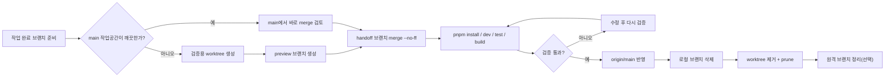

# Git Worktree / Branch 운영 정리

- 작성일: 2026-02-18
- 대상: `agent_qa_dev` 저장소 운영 기준

## 1) 핵심 개념

### Branch
- 브랜치는 "커밋을 가리키는 포인터"다.
- 기능 단위 작업은 보통 `feature/*`, `codex/*` 같은 브랜치에서 진행한다.
- 병합이 끝나면 로컬/원격 브랜치는 정리 대상이 된다.

### Worktree
- 워크트리는 "같은 Git 저장소를 다른 폴더로 동시에 체크아웃"하는 기능이다.
- `main` 작업 폴더를 건드리지 않고, 별도 폴더에서 머지/검증을 안전하게 수행할 수 있다.
- 머지 검증용 워크트리는 임시로 만들고, 확인 후 제거하는 패턴이 실수 방지에 유리하다.

## 2) 왜 검증용 Worktree를 쓰는가

- `main` 작업 폴더가 dirty 상태여도 머지 검증을 분리할 수 있다.
- 실수로 기존 작업 파일을 섞어 커밋하는 사고를 줄일 수 있다.
- 실제 병합 전, UI 실행(`dev`)과 품질 게이트(`test`, `build`)를 독립적으로 확인할 수 있다.

## 3) 권장 표준 흐름

1. 핸드오프 브랜치 확인 (`codex/*` 등)
2. 검증용 워크트리 생성 (`main` 기준)
3. 검증 브랜치에서 `--no-ff` 머지
4. 의존성 설치 후 `dev/test/build` 검증
5. 문제 없으면 `origin/main` 반영
6. 작업 종료 후 워크트리/브랜치 정리

## 4) Mermaid 플로우차트



## 5) 실무 명령 템플릿

### 5.1 검증용 워크트리에서 머지 확인

```bash
HANDOFF_BRANCH=codex/common-untility
REPO_ROOT=/Users/ago0528/Desktop/files/01_work/01_planning/01_vibecoding/ats
PREVIEW_WT=/tmp/ats-merge-check

cd "$REPO_ROOT"
git worktree add "$PREVIEW_WT" main
cd "$PREVIEW_WT"
git switch -c preview/merge-check
git merge --no-ff "$HANDOFF_BRANCH"

pnpm -C agent_qa_dev/backoffice/frontend install
pnpm -C agent_qa_dev/backoffice/frontend dev
pnpm -C agent_qa_dev/backoffice/frontend test
pnpm -C agent_qa_dev/backoffice/frontend build
```

### 5.2 main 반영

```bash
cd /Users/ago0528/Desktop/files/01_work/01_planning/01_vibecoding/ats
git switch main
git pull --ff-only
git push origin HEAD:main
```

## 6) 자주 겪는 상황과 해석

### `fatal: '/tmp/ats-merge-check' already exists`
- 이미 같은 경로에 워크트리가 존재한다는 의미다.
- 해결: `git worktree list`로 확인하고, 기존 워크트리를 재사용하거나 제거 후 재생성한다.

### `Please enter a commit message ...`
- `git merge --no-ff` 시 머지 커밋 메시지 편집기가 열린 정상 상태다.
- 저장 후 종료하면 머지가 완료된다.

### `vite: command not found` + `node_modules missing`
- 새 워크트리에는 의존성이 없어서 생기는 정상 상황이다.
- 해결: `pnpm -C ... install` 후 다시 실행한다.

## 7) 종료 후 정리 원칙

- 로컬: `main`만 남기고 작업 브랜치 삭제
- 워크트리: 임시 워크트리 제거 + `git worktree prune`
- 원격: 머지 완료 브랜치(`codex/*`)는 필요 없으면 삭제

브랜치/워크트리 정리는 "기록 삭제"가 아니라 "운영 상태 정리"다.  
머지된 커밋과 PR 이력은 `main` 및 GitHub 기록에 남는다.

## 8) 자동화 스크립트 사용

반복 작업은 아래 스크립트로 처리할 수 있다.

```bash
scripts/worktree_release.sh prepare --handoff codex/my-feature
# (수동 QA)
scripts/worktree_release.sh promote
scripts/worktree_release.sh cleanup --delete-handoff-local
```

세부 운영 규칙은 `docs/skills/worktree-merge-release/SKILL.md`를 따른다.
