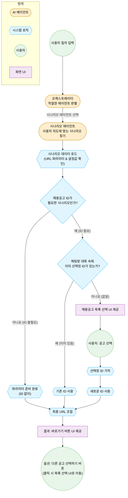

사용자의 피드백을 반영하여, **Agent의 개입을 최소화하고 규칙(Logic)과 데이터(Data) 중심으로 속도를 극대화**하는 방향으로 설계를 구체화했습니다.

특히 2번 포인트(Parameter 추출)에 대해, LLM(Agent)을 대체할 수 있는 **두 가지 효율적인 방안**을 먼저 제안하고, 이를 반영한 전체 플로우차트를 그리겠습니다.

---

### 💡 제안: Data Key(Parameter) 추출을 위한 Agent 대체 방안

사용자가 언급한 "중복 지원 방지" 예시를 보면, 이는 **'자연어 의도'를 '구체적인 기능/메뉴'로 매핑**하는 작업입니다. 이를 위해 무거운 LLM Agent를 매번 띄우는 것은 비효율적입니다.

#### **방안 A. 시나리오 데이터 고도화 (Static Mapping) - [추천]**

현재 `scenario_data.json`을 보면 이미 `RECRUIT_PLAN_DUPLICATE_APPLY_CRITERIA`라는 시나리오 ID가 존재합니다. 즉, **Scenario Agent가 시나리오를 찾은 시점에 이미 사용자의 의도는 '중복 지원 설정'으로 좁혀졌습니다.**

- **방법:** `scenario_data.json`에 `targetUrlParams` 필드를 미리 정의해둡니다.
- **예시:**
  ```json
  "id": "RECRUIT_PLAN_DUPLICATE_APPLY_CRITERIA",
  "targetUrlParams": { "tab": "recruit_sector", "focus": "duplicate_prevent" }
  ```
- **장점:** Latency **0ms**. 시나리오가 매핑되면 파라미터는 즉시 결정됩니다. 가장 확실하고 빠릅니다.

#### **방안 B. Vector Search (Semantic Search)**

시나리오 매핑만으로는 부족한 경우(예: '설정 수정' 시나리오 내에서 수십 개의 세부 옵션을 찾아야 할 때) 사용합니다.

- **방법:** 모든 UI 페이지/기능의 설명과 파라미터를 임베딩(Vector)하여 DB에 저장해두고, 사용자 발화와 유사도가 가장 높은 기능을 검색합니다.
- **장점:** LLM보다 훨씬 빠르고 싸며, 시나리오에 없는 엣지 케이스도 대응 가능합니다.
- **단점:** 임베딩 모델 서버나 벡터 DB 구축/관리가 필요합니다.

👉 **결론:** 현재 프로젝트 상황(빠른 구현, 명확한 시나리오)상 **[방안 A. Static Mapping]**을 우선 적용하고, 이것으로 커버 안 되는 복잡한 케이스만 **[방안 B]**나 기존 Agent를 사용하는 **하이브리드 방식**을 추천합니다. 아래 플로우차트는 **방안 A**를 기준으로 설계했습니다.

---

### 📊 개선된 Logic-Driven Flowchart

기존 순차적 Agent 방식에서 **Event-Driven & Logic 분기 방식**으로 변경하여 대기 시간을 획기적으로 줄였습니다.



---

### ✅ 구현 시 챙겨야 할 점 (Checklist)

이 플로우를 코드로 옮길 때 반드시 수정하거나 확인해야 할 사항들입니다.

#### 1. Data Schema 변경 (`scenario_data.json`)

LLM 의존성을 낮추기 위해 JSON에 명시적인 제어 필드를 추가해야 합니다.

- `requiresRecruitPlanId` (Boolean): `true`면 로직이 Context를 체크하고 없으면 List UI를 띄웁니다.
- `targetPath` (String): 이동할 기본 경로 (예: `/recruit/plan/{id}/setting`)
- `targetUrlParams` (Object): 고정 파라미터 (예: `{"view": "detail", "tab": "applicant"}`)

#### 2. Logic Controller 구현 (Frontend/Backend)

기존 `Scenario Script Agent`가 하던 일을 대체할 **가벼운 로직 함수**가 필요합니다.

- `ScenarioController`: 시나리오 객체를 받아서 -> ID 필요 여부 체크 -> Context 체크 -> 분기 처리하는 핵심 로직.
- 이 함수는 LLM을 전혀 호출하지 않으므로 실행 시간이 즉시 완료되어야 합니다.

#### 3. Parameter Mapping 전략

- 대부분의 경우 `scenario_data.json`의 `targetUrlParams`를 그대로 사용합니다.
- 만약 동적 파라미터(예: 사용자 입력 값)가 꼭 필요한 시나리오라면, 그 시나리오만 예외적으로 **Parameter Extraction Agent**를 타도록 분기 처리합니다. (전체 성능 저하 방지)

#### 4. '다른 채용 선택' UX (Context Switching)

- ID가 있어서 바로 결과 UI가 떴을 때, 사용자가 당황하지 않도록 **"현재 [2024 상반기 공채] 기준으로 안내되었습니다."** 라는 문구와 함께 **[변경]** 버튼을 노출합니다.
- 이 버튼 클릭 시, 4.1.2번 플로우(채용 선택 리스트 UI)를 재활용합니다.

---

이 설계대로라면 **기존 60초 이상 걸리던 작업이, (시나리오 매핑 시간을 제외하면) 1~2초 이내의 UI 인터랙션 속도로 단축**될 것입니다.

이 플로우와 체크리스트에 동의하시면, **1번(JSON 스키마 변경)**부터 순차적으로 코드 구현을 시작하겠습니다. 진행해도 될까요?
