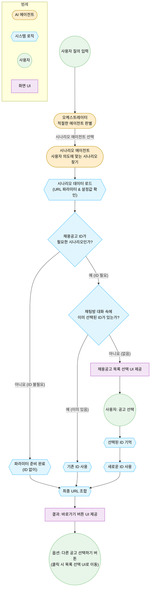

# 시나리오 기반 화면 이동 로직 개선안 (24.12.10)

## 1. 개요 및 배경

### 1.1 현황

- 현재 ATS 솔루션의 `Agentic System`은 사용자의 질의를 분석하여 적절한 화면으로 이동시켜주는 기능을 수행 중.
- **Scenario Agent**가 시나리오를 찾고, **Scenario Script Agent**(LLM)가 추가 정보를 수집하는 순차적 구조.

### 1.2 문제점

- **속도 이슈**: LLM(Script Agent)이 매번 개입하여 판단하므로 리스트 선택 및 답변 제공에 **60초 이상** 소요됨.
- **비효율적 프로세스**: 이미 정해진 파라미터나 로직임에도 불필요하게 LLM이 추론 과정을 거침.
- **UX 불안정성**: `DATA_UI_GENERATOR`를 통한 UI 생성이 일관되지 않을 수 있음.

### 1.3 개선 목표

- **Rule-based Logic 도입**: 확정적인 절차는 코드로 처리하여 **Latency를 1~2초 이내**로 단축.
- **Context 활용**: 사용자 대화 맥락(Context)에 채용공고 ID가 있다면 즉시 활용.
- **Hybrid Approach**: 로직으로 해결 가능한 부분은 로직으로, 유연성이 필요한 부분만 LLM 활용.

---

## 2. 핵심 개선 전략

### 2.1 데이터 주도(Data-Driven) 로직 설계

- LLM의 추론에 의존하던 판단 기준을 `scenario_data.json`의 명시적 필드로 이관.
- **`requiresRecruitPlanId`**: 채용공고 ID 필요 여부 (True/False).
- **`targetUrlParams`**: 이동할 화면의 고정 파라미터 매핑.

### 2.2 채용공고 ID 처리 프로세스 최적화

- **ID 불필요 시나리오**: 즉시 URL 생성.
- **ID 필요 시나리오**:
  1. **Context Check**: 채팅방 내에 이미 선택된 ID가 있는지 확인.
  2. **있음**: 즉시 URL 생성 (질문 생략).
  3. **없음**: 즉시 채용공고 목록 UI 제공 (LLM 거치지 않음).

### 2.3 UX/UI 개선 (Implicit Action)

- 사용자에게 꼬치꼬치 묻지 않고, 가장 확률 높은 결과(URL)를 **즉시 보여줌**.
- 만약 다른 공고를 원할 경우를 대비해 **[다른 공고 선택하기]** 버튼을 옵션으로 제공.

---

## 3. 개선된 플로우차트 (Logic-Driven Flow)



---

## 4. 구현 가이드 (Checklist)

### 4.1 Data Schema 변경 (`scenario_data.json`)

기존 JSON 데이터에 로직 제어를 위한 필드를 추가합니다.

```json
{
  "id": "RECRUIT_PLAN_DUPLICATE_APPLY_CRITERIA",
  "title": "채용의 중복 지원 차단 설정",
  "description": "...",
  // [NEW] 채용공고 ID 필요 여부
  "requiresRecruitPlanId": true,
  // [NEW] 이동할 화면의 기본 경로 및 파라미터
  "targetInfo": {
    "path": "/recruit/plan/{recruitPlanId}/setting",
    "params": {
      "tab": "recruit_sector",
      "focus": "duplicate_prevent"
    }
  }
}
```

### 4.2 Logic Controller 구현

`ScenarioController` (또는 유사 서비스)에서 다음 로직을 순차적으로 수행합니다.

1.  **매핑**: `Scenario Agent`가 반환한 `scenarioId`로 JSON 데이터를 조회.
2.  **파라미터 로드**: `targetInfo` 내의 파라미터를 메모리에 로드.
3.  **ID 체크**:
    - `requiresRecruitPlanId`가 `true`인지 확인.
    - `true`라면 현재 Session/Context에서 `recruitPlanId` 조회.
4.  **분기 처리**:
    - ID가 없으면 → **List UI Return** (Client가 렌더링).
    - ID가 있으면 → **URL 생성 후 Result UI Return**.

### 4.3 UX 처리

- **결과 메시지**: "요청하신 중복 지원 차단 설정 화면으로 이동합니다."
- **옵션 버튼**: 결과 카드 하단에 작은 칩(Chip)이나 버튼 형태로 `[다른 채용공고 선택]` 제공.
- **클릭 액션**: 해당 버튼 클릭 시, 4.2의 'ID가 없는 경우' 로직(List UI)을 강제로 호출.


