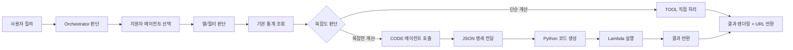
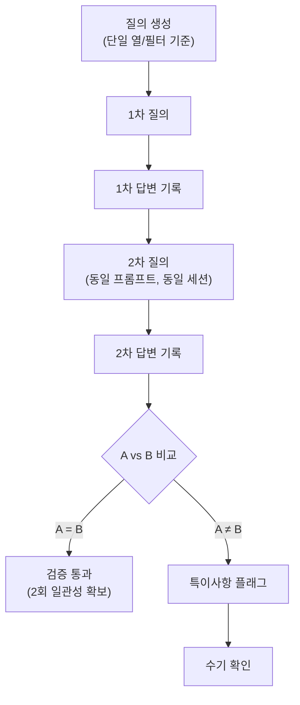
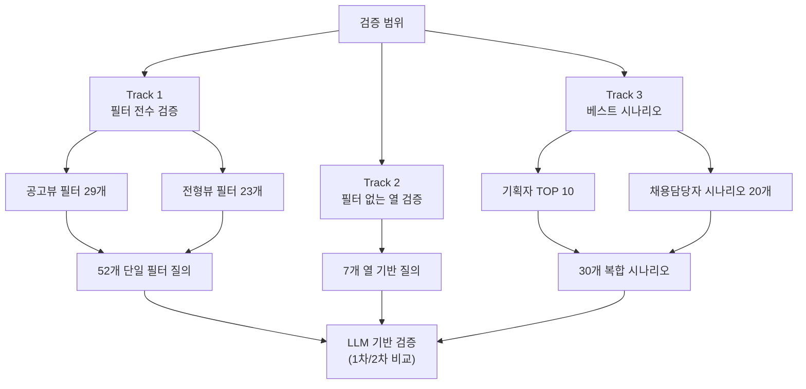

## 1. 개요

지원자 관리 에이전트는 사용자의 통계/분석 질의를 처리하는 에이전트로, 질의 복잡도에 따라 TOOL 직접 처리 또는 CODE 에이전트 호출로 분기한다.

---

## 2. 에이전트 플로우

### 2.1 전체 흐름



### 2.2 상세 플로우

| 단계 | 설명                                                                                      |
| ---- | ----------------------------------------------------------------------------------------- |
| 1    | 사용자가 지원자 관련 통계 질의 입력                                                       |
| 2    | Orchestrator가 질의 유형 판단 후 지원자 에이전트 선택                                     |
| 3    | 에이전트가 필요한 열(Column)과 필터(Filter) 결정                                          |
| 4    | 필터 기준으로 기본 통계 조회 (예: 나이가 NN세인 지원자 수)                                |
| 5    | 복잡도 판단 기준에 따라 분기                                                              |
| 5.1  | [복잡한 계산] CODE 에이전트에 JSON 명세 전달 → Python 코드 생성 → Lambda 실행 → 결과 반환 |
| 5.2  | [단순 계산] TOOL에서 직접 통계 처리                                                       |
| 6    | 통계 데이터를 화면에 렌더링하고 URL 반환                                                  |

---

## 3. 복잡도 판단 기준

### 3.1 에이전트 분기 기준표

| 사용 에이전트     | 계산 로직                | 사용자 요청 예시                                            | 적용 필터                                        |
| ----------------- | ------------------------ | ----------------------------------------------------------- | ------------------------------------------------ |
| **TOOL**          | ~별 지원자 수 (5개 이하) | 지원경로별 지원자 수, 지원분야별 지원자 수, 전형단계별 인원 | 지원경로, 지원분야, 전형결과, 최종학력, 졸업구분 |
| **TOOL**          | ~별 비율 (5개 이하)      | 종합평가 상위 N%, 역량검사 점수 상위 N%                     | 종합평가 평균, 역량 종합점수, 역량 종합등수      |
| **CODE**          | ~별 지원자 수 (5개 초과) | 지원경로별 지원자 수, 지원분야별 지원자 수, 전형단계별 인원 | 지원경로, 지원분야, 전형결과, 최종학력, 졸업구분 |
| **CODE**          | ~별 지원자 수 + 정렬     | TOP N, 많은 순/적은 순 정렬                                 | 지원경로, 지원분야, 전형결과, 최종학력, 졸업구분 |
| **CODE**          | ~별 평균(AVG)            | 공고별 종합평가 평균, 지원경로별 종합평가 평균              | 종합평가 평균, 역량 종합점수, 역량 종합등수      |
| **CODE + 벡터DB** | 의미 기반 집합 통계      | 서울권 학교 수, 지거국 학교 수, 어학 계열 전공 수           | 학교명, 자격증명, 회사명 등                      |

### 3.2 강제 CODE 전환 조건

- 지원자 수 ≥ **30,000명**

---

## 4. 검증 방식

### 4.1 검증 목적

1. 에이전트가 올바른 열/필터를 호출하는지 확인
2. 동일 질의에 대해 일관된 통계 결과를 반환하는지 확인

### 4.2 검증 절차



### 4.3 검증 판단 기준

| 검증 항목              | 판단 방식               | 결과                        |
| ---------------------- | ----------------------- | --------------------------- |
| 필수 열/필터 호출 여부 | 규칙 기반 (기대값 매칭) | 호출 여부 → 스코어링        |
| 통계 데이터 일관성     | LLM 비교 (1차 vs 2차)   | 일치 / 차이 발생 → 스코어링 |
| 차이 발생 시           | 수기 확인 플래그        | 특이사항 체크               |

### 4.4 동일 세션(ConversationId 공유) 방식 채택 이유

LLM은 동일 세션에서 같은 질문을 반복하면 이전 답변을 참조해 보정하는 경향이 있음. 이를 활용하여:

- **A = B인 경우**: 1차에서 이미 최적 답변 도달 → 신뢰도 높음
- **A ≠ B인 경우**: 1차 답변에 개선 여지가 있었다는 신호 → 프롬프트/로직 점검 필요

---

## 5. 검증 범위

### 5.1 검증 구조 개요



### 5.2 Track 1: 필터 전수 검증

단일 필터를 호출하는 질의로 구성하여 검증 진행 (총 질의 수: 52개)

### 공고뷰 필터 (29개)

| 카테고리           | 필터명                                                                                                                | 개수 |
| ------------------ | --------------------------------------------------------------------------------------------------------------------- | ---- |
| 기본 정보          | 지원서 제출 여부, 지원서 등록 구분, 과거 지원 이력, 특이지원자, 열람 여부, 관리자 업로드 파일                         | 6    |
| 지원자 기초 정보   | 지원 경로, 국적, 병역, 장애, 보훈                                                                                     | 5    |
| 학력/경력 정보     | 최종학력, 졸업 구분, 고등학교명, 대학교명, 대학원명, 대학교 전공명, 대학원 전공명, 학점, 경력기준, 경력기간, 프로젝트 | 11   |
| 어학/자격/기타정보 | 외국어 시험, 외국어 활용, 해외경험, 자격증, 교육이수, 학내외 활동, 봉사활동                                           | 7    |

### 전형뷰 필터 (23개)

| 카테고리          | 필터명                                                                                                      | 개수                        |
| ----------------- | ----------------------------------------------------------------------------------------------------------- | --------------------------- |
| 평가 정보         | 최종 합격 여부, 전형 결과, 스크리닝 종합 결과, 지원서 커트라인, 역량검사 커트라인, 최종 평가자, 일반 평가자 | 7 \*_'종합 평가 평균' 제외_ |
| 역량검사 정보     | 응시 현황, 역량 종합 등급, 역량 종합 등수, 역량 종합 등수(분야내), 응답 신뢰성                              | 5 \*_'역량 등급 점수' 제외_ |
| NCS 역량검사 정보 | 핵심 종합 등급, 핵심 종합 점수, 핵심 종합 등수, 핵심 종합 등수(분야 내), 응답 신뢰성(NCS)                   | 5                           |
| 메시지 정보       | 다음 전형 참석, 면접 참석 회신, 전형 안내, 합격자 발표, SMS 발송 시도, 메일 발송 시도                       | 6                           |

### 5.3 Track 2: 필터 없는 열 검증

필터로 제공되지 않지만 질의에 사용될 수 있는 열 (총 질의 수: 7개)

| 열              | 필드명                    | 질의 예시                    |
| --------------- | ------------------------- | ---------------------------- |
| 성별            | genderFlag                | "남성 지원자 수"             |
| 나이            | age                       | "26세~35세 지원자"           |
| 지원서 작성일자 | createDatetime            | "이번 달에 작성된 지원서"    |
| 이름            | name                      | "김OO 지원자 검색"           |
| 총경력          | totalCareer               | "경력 5년 이상 지원자"       |
| 종합등수        | totalRankOverall          | "상위 10명 지원자"           |
| 지망            | priority (applySector 내) | "1지망으로 지원한 지원자 수" |

### 5.4 Track 3: 베스트 시나리오 검증

### 기본 조건

- 기간 필터 기본값: **1년**
- 공고명/채용분야명: **$공고명$**, **$채용분야명$** 으로 표기 (추후 치환)

### 검증 대상 기업 특성

- 업종: 다양 (그룹 형태 기업)
- 채용 규모: 연간 지원자 30,000명 이상
- 전형 구조: 서류 → 역량검사 → 면접 (다양한 변형 존재)
- 채용 유형: 공개채용 비중 높음, 경력직 비중 높음
- 사용자: 실무 채용담당자 (현업 부서장 리포팅)

### 기획자 TOP 10 시나리오 (10개)

| **ID** | **질의**                                             | **핵심 필터/열** | **패턴**         |
| ------ | ---------------------------------------------------- | ---------------- | ---------------- |
| T-01   | 지원서 제출 완료한 지원자 수 조회해줘                | 지원서 제출      | 단일 조건 카운트 |
| T-02   | 지원경로별로 지원자 수 조회해줘                      | 지원경로         | 그룹핑           |
| T-03   | 서울대학교 지원자 수 조회해줘                        | 학교명           | 특정값 검색      |
| T-04   | 대학교별 지원자 수 조회해줘                          | 학교명           | 그룹핑 (다수)    |
| T-05   | 서울권 대학교의 지원자 수 통계내줘                   | 학교명           | 의미 기반 집합   |
| T-06   | 지원자 수가 많은 순으로 지원경로를 정렬해줘          | 지원경로         | 정렬             |
| T-07   | 공고별로 전체 지원자의 종합점수 평균을 내줘          | 종합점수         | AVG 연산         |
| T-08   | 지원을 특히 많이한 학교들이 어디에있는지 알 수 있어? | 학교명           | 자연어 TOP N     |
| T-09   | $공고명$에서 지원분야별로 지원자 수 조회해줘         | 공고 + 지원분야  | 복합 조건 그룹핑 |
| T-10   | $공고명$에서 지원분야별로 지원자 많은순으로 조회해줘 | 공고 + 지원분야  | 복합 조건 + 정렬 |

### 채용담당자 추가 시나리오 (20개)

_(하단 첨부한 질의 CSV 확인)_

---

## 6. 검증 결과 기록 항목

모든 Track은 동일한 검증 프로세스(1차/2차 답변 LLM 비교)를 따르며, 동일한 컬럼으로 기록한다.

| **항목**          | **설명**                               |
| ----------------- | -------------------------------------- |
| 질의 ID           | 고유 식별자                            |
| Track             | Track 1 / Track 2 / Track 3            |
| 카테고리          | 공고뷰-기본 정보, 시나리오-지원현황 등 |
| 질의 내용         | 사용자 질의 텍스트                     |
| 기대 열/필터      | 호출되어야 하는 열 또는 필터           |
| 1차 답변          | 첫 번째 응답 내용                      |
| 2차 답변          | 두 번째 응답 내용 (동일 세션)          |
| 열/필터 일치 여부 | Pass / Fail                            |
| 답변 일관성       | 일치 / 차이 발생                       |
| 차이 유형         | 열/필터 변경 / 통계값 변경 / 표현 변경 |
| 특이사항          | 메모                                   |
| 더블체크 여부     | 수기 확인 완료 / 미완료                |

---

## 7. 검증 질의

- [v14.2.0\_에이전트 질의 리스트\_260130.xlsx](https://midasinfra-my.sharepoint.com/:x:/g/personal/ago0528_jainwon_com/IQDNs7Uiq4VvQqtTYtjWvORXAZaLnmK9fM1ty5jLts2vnK8?e=U2D9In)
- 지원자 관리 질의 시트 확인

---

## 8. 스코어링 규칙

### 8.1 평가 지표 개요

| 지표         | 설명                                       | 점수 범위 |
| ------------ | ------------------------------------------ | --------- |
| **안정성**   | 응답이 정상적으로 반환되었는지 (에러/Null) | 0, 3, 5   |
| **정확도**   | 응답이 질의 의도를 얼마나 충족했는지       | 0~5점     |
| **일관성**   | 1차/2차 응답이 의미적으로 동일한 결과인지  | 0~5점     |
| **종합점수** | 세 지표의 단순 평균                        | 0~5점     |

### 8.2. 안정성 (Stability)

응답이 정상적으로 반환되었는지 판단한다. 에러 발생 또는 Null 응답 여부를 확인한다.

### 8.2.1. 점수 기준

| 점수 | 기준                                              |
| ---- | ------------------------------------------------- |
| 5    | 1차/2차 모두 정상 응답                            |
| 3    | 1차 또는 2차 중 하나만 정상 응답 (한쪽 에러/Null) |
| 0    | 1차/2차 모두 에러 또는 Null                       |

### 8.2.2. 판단 원칙

- 안정성 **0점** → 정확도/일관성 평가 불가 → 해당 항목 모두 **0점 처리**
- 안정성 **3점** → 정상 응답 1개로만 정확도 평가, 일관성은 **평가 불가(0점)**
- 안정성 **5점** → 정확도/일관성 모두 평가 진행

### 8.3. 정확도 (Accuracy)

**응답이 질의 의도를 얼마나 충족했는지** 정성적으로 평가한다.

에이전트는 질의에 따라 두 가지 방식으로 데이터를 처리한다:

- **필터 기반**: 시스템 필터를 사용하여 조건에 맞는 데이터 조회
- **열 기반**: 필터가 없는 경우 API로 전체 데이터를 가져온 후 열을 기준으로 직접 집계

두 방식이 혼합될 수 있으므로, 필터/열 구분 없이 **"질의 의도 충족도"**를 기준으로 평가한다.

### 8.3.1. 점수 기준

| 점수 | 기준                                                                           |
| ---- | ------------------------------------------------------------------------------ |
| 5    | 질의 의도를 완벽히 이해하고, 요청한 모든 항목을 정확히 응답함                  |
| 4    | 질의 의도를 이해하고 대부분 응답했으나, 일부 누락 또는 불필요한 추가 정보 포함 |
| 3    | 질의 의도를 대체로 이해했으나, 핵심 항목 일부 누락                             |
| 2    | 질의 의도를 일부만 반영, 응답이 불완전함                                       |
| 1    | 질의 의도와 동떨어진 응답                                                      |
| 0    | 질의와 무관한 응답 또는 평가 불가 (안정성 0점)                                 |

### 8.3.2. 정성 평가 체크리스트

| 체크 항목     | 확인 내용                                                             |
| ------------- | --------------------------------------------------------------------- |
| 집계 대상     | 질의에서 요청한 대상(예: 남성 지원자, 26~35세)이 응답에 포함되었는가? |
| 집계 조건     | 질의에서 명시한 조건(예: 최근 3개월, 경력 5년 이상)이 반영되었는가?   |
| 출력 형식     | 질의에서 요청한 형식(예: 표, 비율, Top N, 정렬)이 반영되었는가?       |
| 논리적 일관성 | 응답 수치가 질의 조건과 논리적으로 맞는가?                            |
| 간결성        | 불필요한 정보 없이 질의에 집중했는가?                                 |

### 8.3.3. 기간 필터 특별 규칙

| 상황                                                          | 처리 방식                      |
| ------------------------------------------------------------- | ------------------------------ |
| 질의에 기간 미명시 + 응답에서 "1년/최근 1년/365일" 사용       | 정상 (Default 기간, 감점 없음) |
| 질의에 기간 미명시 + 응답에서 다른 기간 사용 (예: 3개월)      | 유의사항 기록 (4점)            |
| 질의에 "최근 3개월" 명시 + 응답에서 "최근 3개월" 사용         | 정상                           |
| 질의에 "최근 3개월" 명시 + 응답에서 "1년" 또는 다른 기간 사용 | 감점 대상 (2~3점)              |

### 8.4. 일관성 (Consistency)

1차 응답과 2차 응답이 의미적으로 동일한 결과(집계 수치)를 반환했는지 판단한다.

### 8.4.1 비교 항목

| 우선순위 | 비교 항목        | 예시                   | 비고             |
| -------- | ---------------- | ---------------------- | ---------------- |
| 1        | 핵심 수치        | 지원자 수, 평균 점수   | 정확히 일치 필요 |
| 2        | 순위/정렬 결과   | Top N 목록, 1위 항목   | 순서까지 일치    |
| 3        | 집계 기준        | 그룹핑 열, 필터 조건   | 동일 기준 적용   |
| 4        | 출력 포맷/표현   | 테이블 컬럼 수, 소수점 | 허용 가능한 차이 |
| 5        | 문장 표현/스타일 | 안내 문구, 마크다운    | 무시             |

### 8.4.2 점수 기준

| 점수 | 기준                                                             |
| ---- | ---------------------------------------------------------------- |
| 5    | 핵심 데이터(수치, 순위) 완전 일치                                |
| 4    | 핵심 데이터 일치 + 표현/포맷 차이 (테이블 컬럼 수, 문장 표현 등) |
| 3    | 핵심 데이터 대부분 일치, 일부 수치 미세 차이 (반올림, 소수점 등) |
| 2    | 핵심 데이터 일부만 일치, 순위나 주요 수치 불일치                 |
| 1    | 핵심 데이터 대부분 불일치                                        |
| 0    | 완전히 다른 결과 또는 평가 불가 (안정성 3점 이하)                |

### 8.4.3 판단 원칙

- 표현만 다르고 의미하는 바가 같으면 "일치"로 판단 (예: "152명입니다" vs "총 152명이에요")
- 숫자 포맷 차이는 감점하지 않음 (예: "990점" vs "990.0점")
- 테이블 컬럼 수나 순서 차이는 경미한 차이로 처리 (4점)

### 8.5. 종합 점수 산정

- 종합 점수 = (안정성 + 정확도 + 일관성) / 3
- 최종 점수는 소수점 둘째 자리까지 표기 (예: 4.33점)

### 8.6. 평가 입력 형식

```yaml
query_id: "T-22"
query: "채용분야별로 토익 평균이랑 학점 평균을 표로 보여주고 토익 평균 높은 순 Top 5로 정렬해줘"
expected_filters:
  - 지원분야
  - 외국어시험
  - 학점
response_1: |
  {1차 응답 전문}
response_2: |
  {2차 응답 전문}
```

### 8.7. 평가 출력 형식

```json
{
  "query_id": "T-22",
  "stability": {
    "score": 5,
    "response_1_status": "정상",
    "response_2_status": "정상",
    "note": ""
  },
  "accuracy": {
    "score": 4,
    "expected": ["지원분야", "외국어시험", "학점"],
    "checklist": {
      "집계 대상": "충족",
      "집계 조건": "부분 충족",
      "출력 형식": "충족",
      "논리적 일관성": "충족",
      "간결성": "충족"
    },
    "note": "학점 평균이 응답에 누락됨"
  },
  "consistency": {
    "score": 4,
    "matched": [
      "1위 채용분야(경력-2-영업)",
      "토익 평균 점수(990점)",
      "Top 5 순위 동일"
    ],
    "diff": ["테이블 컬럼 수 차이(5개 vs 3개)"],
    "note": "핵심 데이터 일치, 출력 포맷만 상이"
  },
  "total_score": 4.33,
  "remarks": "학점 평균 누락으로 정확도 감점. 1차/2차 핵심 결과는 동일."
}
```

### 8.8. 주의사항

1. **평가 순서**: 반드시 **안정성 → 정확도 → 일관성** 순서로 평가한다. 안정성 점수에 따라 이후 평가 가능 여부가 결정된다.
2. **정확도 평가 시**: 필터 사용 여부가 아닌, **응답이 질의 의도를 얼마나 충족했는지**를 기준으로 평가한다. 에이전트가 필터를 사용했든 열 기반으로 직접 집계했든, 결과가 질의 의도에 맞으면 높은 점수를 부여한다.
3. **Response 구조**: `assistantMessage`, `dataUIList`, `guideList` 등 모든 필드를 종합적으로 분석한다.
4. **의미 기반 집합 필터**: SKY, 인서울, 지거국, 이공계 등은 정확한 범위 정의가 어려울 수 있으므로, 합리적인 범위 내에서 사용되었다면 정상으로 판단한다.
5. **가이드 제공**: 에이전트가 추가 질문을 던지거나 가이드를 제공한 경우(`guideList`)는 감점 요소가 아니다.
6. **응답 시간**: 1차/2차 응답 시간 차이는 평가 지표에 포함하지 않는다. (참고용)
7. **기간 필터**: "1년", "최근 1년", "365일"은 시스템 Default 기간이므로, 질의에 기간이 명시되지 않은 경우 이 값들이 사용되어도 감점하지 않는다.

_E.o.D_
