# Agent Flow 플로우차트

## LangGraph Agent Flow 구조

```mermaid
flowchart LR
    Start([시작: run_agent_with_progress]) --> InitState["초기 상태 생성<br/>- messages: System Prompt<br/>- progress_log: []<br/>- user_request: 사용자 요청"]

    InitState --> AgentNode["오케스트레이터 Agent<br/>(Entry Point)"]

    AgentNode --> LLMCall["LLM 호출 (GPT-5.2)<br/>- 메시지 히스토리 기반<br/>- 도구 바인딩: report_progress, 다른 도구"]

    LLMCall --> CheckToolCalls{"tool_calls<br/>존재 여부"}

    CheckToolCalls -->|"있음"| ToolsNode["도구 실행 Agent"]
    CheckToolCalls -->|"없음<br/>(최종 답변)"| EndNode([종료])

    ToolsNode --> ExecuteTools["도구 실행<br/>- report_progress, 다른 도구"]

    ExecuteTools --> CheckReportProgress{"report_progress<br/>호출 여부"}

    CheckReportProgress -->|"예"| GenerateProgressMsg["진행 상황 메시지 생성<br/>(LLM 동적 생성 또는<br/>정적 매핑 폴백)"]

    CheckReportProgress -->|"아니오"| UpdateState

    GenerateProgressMsg --> UpdateProgressLog["progress_log 업데이트<br/>- title<br/>- description"]

    UpdateProgressLog --> UpdateState["상태 업데이트<br/>- messages: 챗히스토리 추가<br/>- progress_log: 로그 추가"]

    UpdateState --> AgentNode

    EndNode --> FinalOutput["최종 결과(답변)"]

    style Start fill:#e1f5ff
    style EndNode fill:#ffe1e1
    style AgentNode fill:#fff4e1
    style ToolsNode fill:#e1ffe1
    style LLMCall fill:#f0e1ff
    style GenerateProgressMsg fill:#ffe1f0
```



## 주요 컴포넌트 설명

### 1. Agent 노드

- **역할**: LLM을 호출하여 다음 행동 결정
- **입력**: AgentState (messages, progress_log, user_request)
- **출력**: AIMessage (tool_calls 포함 가능)

### 2. Tools 노드

- **역할**: Agent가 선택한 도구 실행
- **실행 가능한 도구**:
  - `report_progress`: 진행 상황 보고
  - `search_conversations`: 과거 대화 검색
  - `read_document`: 문서 읽기

### 3. 조건부 분기 (should_continue)

- **조건**: 마지막 메시지에 tool_calls 존재 여부
- **분기**:
  - `tool_calls 있음` → Tools 노드로 이동
  - `tool_calls 없음` → 종료

### 4. 진행 상황 로깅

- `report_progress` 호출 시 `progress_log`에 기록
- LLM으로 사용자 친화적인 메시지 생성
- 실패 시 정적 매핑 폴백 사용

## 실행 흐름 예시

```
1. 사용자 요청: "기존 채용을 불러오고 싶어"
2. Agent 노드 → LLM 호출 → tool_calls: [report_progress, search_conversations]
3. Tools 노드 → 도구 실행
   - report_progress 실행 → progress_log 업데이트
   - search_conversations 실행
4. Agent 노드로 복귀 → LLM 호출 → tool_calls: [read_document]
5. Tools 노드 → read_document 실행
6. Agent 노드로 복귀 → LLM 호출 → tool_calls 없음 (최종 답변)
7. 종료 → 결과 반환
```
